---
## Front matter
lang: ru-RU
title: Лабораторная работа №1
subtitle: НКАбд-06-23
author:
  - Улитина М.М.
institute:
  - Российский университет дружбы народов, Москва, Россия

date: 02 марта 2024

## i18n babel
babel-lang: russian
babel-otherlangs: english

## Fonts
mainfont: PT Serif
romanfont: PT Serif
sansfont: PT Sans
monofont: PT Mono
mainfontoptions: Ligatures=TeX
romanfontoptions: Ligatures=TeX
sansfontoptions: Ligatures=TeX,Scale=MatchLowercase
monofontoptions: Scale=MatchLowercase,Scale=0.9

## Formatting pdf
toc: false
toc-title: Содержание
slide_level: 2
aspectratio: 169
section-titles: true
theme: metropolis
header-includes:
 - \metroset{progressbar=frametitle,sectionpage=progressbar,numbering=fraction}
 - '\makeatletter'
 - '\beamer@ignorenonframefalse'
 - '\makeatother'
---

# Информация

## Докладчик

:::::::::::::: {.columns align=center}
::: {.column width="70%"}

  * Улитина Мария Максимовна
  * студентка группы НКАбд-06-23
  * Российский университет дружбы народов

:::
::: {.column width="30%"}

:::
::::::::::::::

# Вводная часть

## Цели и задачи

Целью данной работы является приобретение практических навыков установки операционной системы на виртуальную машину, настройки минимально необходимых для дальнейшей работы сервисов.

# Выполнение лабораторной работы

## Создание виртуальной машины

Создадим виртуальную машину в Virtual Box

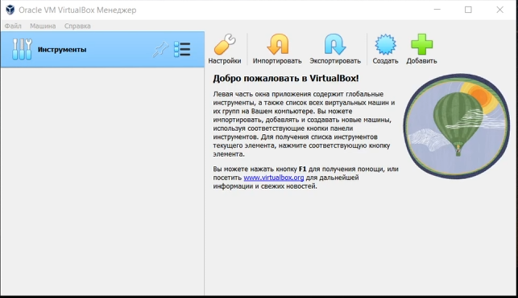

## Установка операционной системы

Установим Linux Fedora, зададим необходимые настройки.

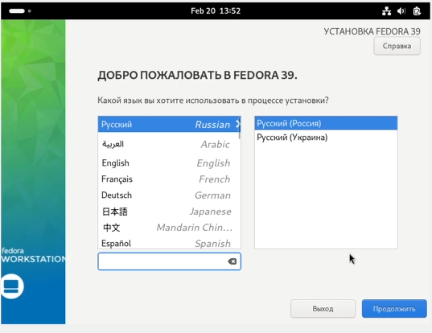

## Обновления

Установим обновления

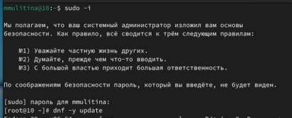

## Повышение комфорта работы

Для повышения комфорта работы установим tmux

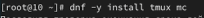

## Установка Pandoc и TexLive

Скачаем вручную pandoc

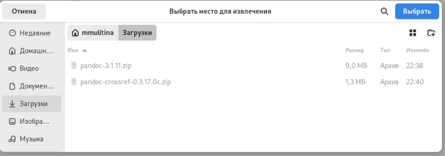

## Установка texlive

Установим texlive 

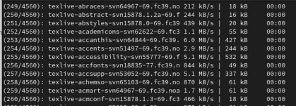

## Выполнение дополнительного задания

## Linux version

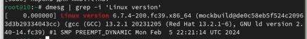

## Частота процессора 

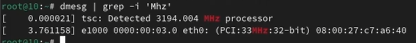

## Модель процессора 

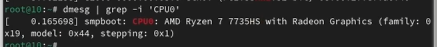

## Объём доступной оперативной памяти

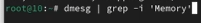

## Тип обнаруженного гипервизора (Hypervisor detected)

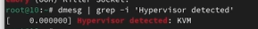

## Тип файловой системы корневого раздела

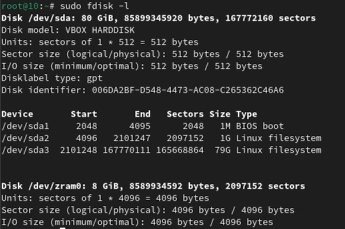

## Последовательность монтирования файловых систем

## Выводы

В процессе выполнения лабораторной работы я приобрела практические навыки установки операционной системы на виртуальную машину, настройки минимально необходимых для дальнейшей работы сервисов.

## Список литературы

1. Лабораторная работа №1.

