---
## Front matter
title: "Лабораторная работа №1"
subtitle: "НКАбд-06-23"
author: "Улитина Мария Максимовна"

## Generic otions
lang: ru-RU
toc-title: "Содержание"

## Bibliography
bibliography: bib/cite.bib
csl: pandoc/csl/gost-r-7-0-5-2008-numeric.csl

## Pdf output format
toc: true # Table of contents
toc-depth: 2
lof: true # List of figures
lot: true # List of tables
fontsize: 12pt
linestretch: 1.5
papersize: a4
documentclass: scrreprt
## I18n polyglossia
polyglossia-lang:
  name: russian
  options:
	- spelling=modern
	- babelshorthands=true
polyglossia-otherlangs:
  name: english
## I18n babel
babel-lang: russian
babel-otherlangs: english
## Fonts
mainfont: PT Serif
romanfont: PT Serif
sansfont: PT Sans
monofont: PT Mono
mainfontoptions: Ligatures=TeX
romanfontoptions: Ligatures=TeX
sansfontoptions: Ligatures=TeX,Scale=MatchLowercase
monofontoptions: Scale=MatchLowercase,Scale=0.9
## Biblatex
biblatex: true
biblio-style: "gost-numeric"
biblatexoptions:
  - parentracker=true
  - backend=biber
  - hyperref=auto
  - language=auto
  - autolang=other*
  - citestyle=gost-numeric
## Pandoc-crossref LaTeX customization
figureTitle: "Рис."
tableTitle: "Таблица"
listingTitle: "Листинг"
lofTitle: "Список иллюстраций"
lotTitle: "Список таблиц"
lolTitle: "Листинги"
## Misc options
indent: true
header-includes:
  - \usepackage{indentfirst}
  - \usepackage{float} # keep figures where there are in the text
  - \floatplacement{figure}{H} # keep figures where there are in the text
---

# Цель работы

Целью данной работы является приобретение практических навыков установки операционной системы на виртуальную машину, настройки минимально необходимых для дальнейшей работы сервисов.

# Задание

1. Настроить виртуальную машину. Установить дистрибутив Linux Fedora.
2. ВЫполнить задание.
3. Ответить на контрольные вопросы.

# Выполнение лабораторной работы

## Создание виртуальной машины

Создадим виртуальную машину в VirtualBox, настроим ее выделим память и вычислительные ресурсы (рис. [-@fig:001])

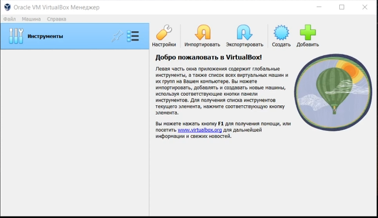{#fig:001 width=70%}

## Установка операционной системы

Установим дистрибутив Linux Fedora, выберем язык, другие настройки, а также введем данные пользователя (рис. [-@fig:002])

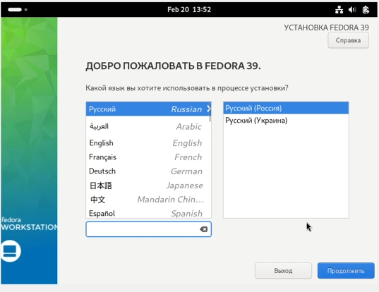{#fig:002 width=70%}

(рис. [-@fig:003])

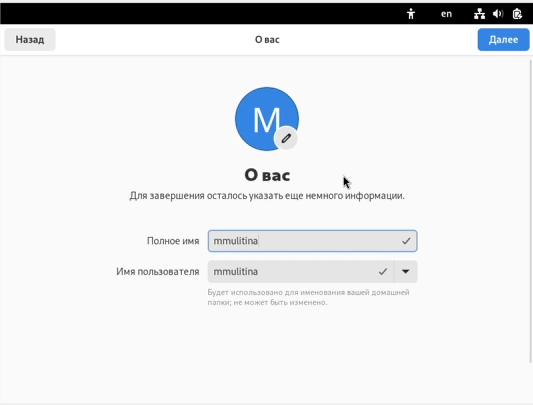{#fig:003 width=70%}

## Обновления

Переключимся на роль суперпользователя и установим обновления (рис. [-@fig:004])

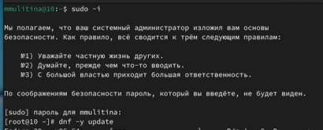{#fig:004 width=70%}

## Повышение комфорта работы

Для повышения комфорта работы установим tmux (рис. [-@fig:005])

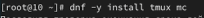{#fig:005 width=70%}

## Отключение SELinux

Отключим SELinux, внеся изменения в конфигурационный файл (рис. [-@fig:006])

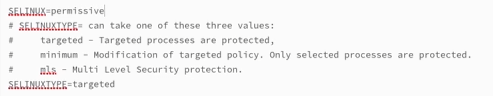{#fig:006 width=70%}

Перезагрузим виртуальную машину командой reboot.

## Установка драйверов для VirtualBox

Переключимся на роль суперпользователя и установим необходимые средства разработки (рис. [-@fig:007])

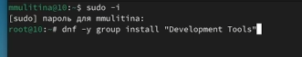{#fig:007 width=70%}

Установим пакет DKMS (рис. [-@fig:008])

{#fig:008 width=70%}

В меню виртуальной машину подключим образ диска дополнительной гостевой виртуальной ОС (рис. [-@fig:009])

{#fig:009 width=70%}

Подмонтируем диск и установим необходимые драйвера (рис. [-@fig:010])

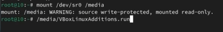{#fig:010 width=70%}

Перезапустим виртуальную машину.

## Настройка раскладки клавиатуры и установка имени пользователя

Данный этап работы был пропущен, т.к. имя пользователя и настройки клавиатуры были изначально верны.

## Установка Pandoc и TexLive

Скачаем вручную необходимю версию pandoc и pandoc-crossref (рис. [-@fig:011])

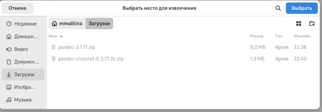{#fig:011 width=70%}

Поместим их в каталог /usr/local/bin.

Установим texlive (рис. [-@fig:012])

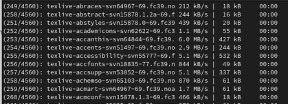{#fig:012 width=70%}

## Домашнее задание

С помощью команды dmesg | grep -i "то, что ищем" узнаем:

Версию ядра Linux (Linux version) (рис. [-@fig:013])

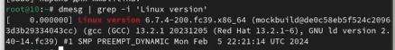{#fig:013 width=70%}

Частоту процессора (Detected Mhz processor)  (рис. [-@fig:014])

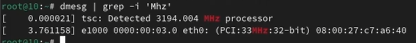{#fig:014 width=70%}

Модель процессора (CPU0) (рис. [-@fig:015])

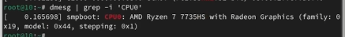{#fig:015 width=70%}

Объём доступной оперативной памяти (Memory available) (рис. [-@fig:016])

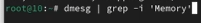{#fig:016 width=70%}

Тип обнаруженного гипервизора (Hypervisor detected) (рис. [-@fig:017])

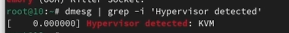{#fig:017 width=70%}

Тип файловой системы корневого раздела (рис. [-@fig:018])

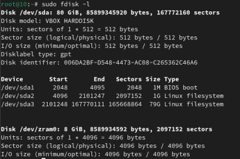{#fig:018 width=70%}

Последовательность монтирования файловых систем (рис. [-@fig:019])

{#fig:019 width=70%}

# Контрольные вопросы

1. Учетная запись пользователя содержит информацию, необходимую для идентификации пользователя, нформацию о группе, к которой он принадлежит, его идентификатор, домашний каталог.

2. Для получения справки по команде -help. Для перемещения по файловой системе -cd. Для просмотра содержимого каталога - ls.
Для определения объема каталога -du. Для создания файла touch, каталога - mkdir. Для удаления файла - rm, удаления каталога - rmdir. Для задания прав на файл или каталог -  chmod. Для просмотра истории команд history.

3. Файловая система - порядок, определяющий способ хранения, организации и именования данных на различных носителях. Yfghbvth?, FAT32, ext2.

4. С помощью df.

5. Узнать id процесса с помощью ps. Потом применяем kill или killall для удаления всех процессов.
-

# Выводы

В процессе выполнения лабораторной работы я приобрела практические навыки установки операционной системы на виртуальную машину, настройки минимально необходимых для дальнейшей работы сервисов.

# Список литературы

1. Лабораторная работа №1.

