---
## Front matter
lang: ru-RU
title: Лабораторная работа №2
subtitle: НКАбд-06-23
author:
  - Улитина М.М.
institute:
  - Российский университет дружбы народов, Москва, Россия

date: 02 марта 2024

## i18n babel
babel-lang: russian
babel-otherlangs: english

## Fonts
mainfont: PT Serif
romanfont: PT Serif
sansfont: PT Sans
monofont: PT Mono
mainfontoptions: Ligatures=TeX
romanfontoptions: Ligatures=TeX
sansfontoptions: Ligatures=TeX,Scale=MatchLowercase
monofontoptions: Scale=MatchLowercase,Scale=0.9

## Formatting pdf
toc: false
toc-title: Содержание
slide_level: 2
aspectratio: 169
section-titles: true
theme: metropolis
header-includes:
 - \metroset{progressbar=frametitle,sectionpage=progressbar,numbering=fraction}
 - '\makeatletter'
 - '\beamer@ignorenonframefalse'
 - '\makeatother'
---

# Информация

## Докладчик

:::::::::::::: {.columns align=center}
::: {.column width="70%"}

  * Улитина Мария Максимовна
  * студентка группы НКАбд-06-23
  * Российский университет дружбы народов

:::
::: {.column width="30%"}

:::
::::::::::::::

# Вводная часть

## Цели и задачи

Изучить идеологию и применение средств контроля версий. Освоить умения по работе с git.

# Выполнение лабораторной работы

## Установка git и gh

Установим git.

## Установка git и gh

Установим gh

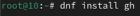

## Базовая настройка git

Зададим имя и email владельца репозитория

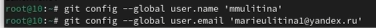

## Создание ключа ssh

По алгоритму rsa создадим ключ

## Ключи pgp

Создадим ключ pgp 

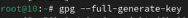

## Добавление PGP ключа в GitHub

Выводим список ключей и копируем отпечаток приватного ключа

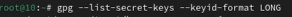

## Настройка автоматических подписей коммитов git

Используя введёный email, укажем Git применять его при подписи коммитов

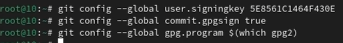

## Настройка gh

Авторизируемся в gh

## Создание репозитория курса на основе шаблона

Создадим шаблон для рабочего пространства

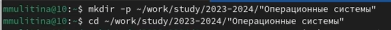

## Создание репозитория курса на основе шаблона

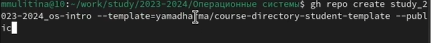

## Создание репозитория курса на основе шаблона

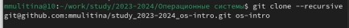

## Настройка каталога курса

Перейдем в каталог курса

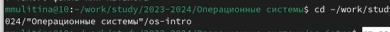

## Настройка каталога курса

Удалим лишние файлы

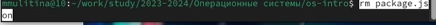

## Настройка каталога курса

Создадим необходимые каталоги

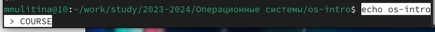

## Настройка каталога курса

Отправим файлы на сервер

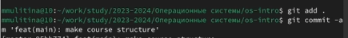

# Выводы

## Выводы

В процессе выполнения работы я изучила применение средств контроля версий Git.

## Список литературы

1. Лабораторная работа №2.

