---
## Front matter
title: "Лабораторная работа №2"
subtitle: "НКАбд-06-23"
author: "Улитина Мария Максимовна"

## Generic otions
lang: ru-RU
toc-title: "Содержание"

## Bibliography
bibliography: bib/cite.bib
csl: pandoc/csl/gost-r-7-0-5-2008-numeric.csl

## Pdf output format
toc: true # Table of contents
toc-depth: 2
lof: true # List of figures
lot: true # List of tables
fontsize: 12pt
linestretch: 1.5
papersize: a4
documentclass: scrreprt
## I18n polyglossia
polyglossia-lang:
  name: russian
  options:
	- spelling=modern
	- babelshorthands=true
polyglossia-otherlangs:
  name: english
## I18n babel
babel-lang: russian
babel-otherlangs: english
## Fonts
mainfont: PT Serif
romanfont: PT Serif
sansfont: PT Sans
monofont: PT Mono
mainfontoptions: Ligatures=TeX
romanfontoptions: Ligatures=TeX
sansfontoptions: Ligatures=TeX,Scale=MatchLowercase
monofontoptions: Scale=MatchLowercase,Scale=0.9
## Biblatex
biblatex: true
biblio-style: "gost-numeric"
biblatexoptions:
  - parentracker=true
  - backend=biber
  - hyperref=auto
  - language=auto
  - autolang=other*
  - citestyle=gost-numeric
## Pandoc-crossref LaTeX customization
figureTitle: "Рис."
tableTitle: "Таблица"
listingTitle: "Листинг"
lofTitle: "Список иллюстраций"
lotTitle: "Список таблиц"
lolTitle: "Листинги"
## Misc options
indent: true
header-includes:
  - \usepackage{indentfirst}
  - \usepackage{float} # keep figures where there are in the text
  - \floatplacement{figure}{H} # keep figures where there are in the text
---

# Цель работы

Изучить идеологию и применение средств контроля версий. Освоить умения по работе с git.

# Задание

1. Создать базовую конфигурацию для работы с git.

2. Создать ключ SSH.

3. Создать ключ PGP.
    
4. Настроить подписи git.
    
5. Зарегистрироваться на Github.
    
6. Создать локальный каталог для выполнения заданий по предмету.

# Теоретическое введение

Системы контроля версий (Version Control System, VCS) применяются при работе нескольких человек над одним проектом. Обычно основное дерево проекта хранится в локальном или удалённом репозитории, к которому настроен доступ для участников проекта. При внесении изменений в содержание проекта система контроля версий позволяет их фиксировать, совмещать изменения, произведённые разными участниками проекта, производить откат к любой более ранней версии проекта, если это требуется.

В классических системах контроля версий используется централизованная модель, предполагающая наличие единого репозитория для хранения файлов. Выполнение большинства функций по управлению версиями осуществляется специальным сервером. Участник проекта (пользователь) перед началом работы посредством определённых команд получает нужную ему версию файлов. После внесения изменений, пользователь размещает новую версию в хранилище. При этом предыдущие версии не удаляются из центрального хранилища и к ним можно вернуться в любой момент. Сервер может сохранять не полную версию изменённых файлов, а производить так называемую дельта-компрессию — сохранять только изменения между последовательными версиями, что позволяет уменьшить объём хранимых данных.

Системы контроля версий поддерживают возможность отслеживания и разрешения конфликтов, которые могут возникнуть при работе нескольких человек над одним файлом. Можно объединить (слить) изменения, сделанные разными участниками (автоматически или вручную), вручную выбрать нужную версию, отменить изменения вовсе или заблокировать файлы для изменения. В зависимости от настроек блокировка не позволяет другим пользователям получить рабочую копию или препятствует изменению рабочей копии файла средствами файловой системы ОС, обеспечивая таким образом, привилегированный доступ только одному пользователю, работающему с файлом.

Системы контроля версий также могут обеспечивать дополнительные, более гибкие функциональные возможности. Например, они могут поддерживать работу с несколькими версиями одного файла, сохраняя общую историю изменений до точки ветвления версий и собственные истории изменений каждой ветви. Кроме того, обычно доступна информация о том, кто из участников, когда и какие изменения вносил. Обычно такого рода информация хранится в журнале изменений, доступ к которому можно ограничить.

В отличие от классических, в распределённых системах контроля версий центральный репозиторий не является обязательным.

Среди классических VCS наиболее известны CVS, Subversion, а среди распределённых — Git, Bazaar, Mercurial. Принципы их работы схожи, отличаются они в основном синтаксисом используемых в работе команд.

# Выполнение лабораторной работы

## Установка git и gh

Установим git (рис. [-@fig:001]).

{#fig:001 width=70%}

Установим gh (рис. [-@fig:002]).

{#fig:002 width=70%}

## Базовая настройка git

Зададим имя и email владельца репозитория (рис. [-@fig:003]).

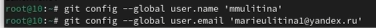{#fig:003 width=70%}

Настроим utf-8 в выводе сообщений git (рис. [-@fig:004]).

{#fig:004 width=70%}

Зададим имя начальной ветки (рис. [-@fig:005]).

{#fig:005 width=70%}

Настроим параметы autocrlf и safecrlf (рис. [-@fig:006]).

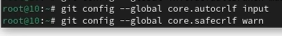{#fig:006 width=70%}

## Создание ключа ssh

По алгоритму rsa создадим ключ размером 4096 бит (рис. [-@fig:007]).

{#fig:007 width=70%}

И по алгоритму ed25519 (рис. [-@fig:008]).

{#fig:008 width=70%}

## Ключи pgp

Создадим ключ pgp (рис. [-@fig:009]).

{#fig:009 width=70%}

Из предложенных опций выбираем тип ключа и его размер(рис. [-@fig:010]).

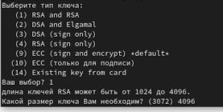{#fig:010 width=70%}

## Добавление PGP ключа в GitHub

Выводим список ключей и копируем отпечаток приватного ключа: (рис. [-@fig:011]).

{#fig:011 width=70%}

Скопируем полученный ключ и добавим его на github.

## Настройка автоматических подписей коммитов git

Используя введёный email, укажем Git применять его при подписи коммитов: (рис. [-@fig:012]).

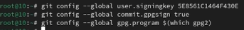{#fig:012 width=70%}

## Настройка gh

Авторизируемся в gh (рис. [-@fig:013]).

{#fig:013 width=70%}

## Создание репозитория курса на основе шаблона

Создадим шаблон для рабочего пространства (рис. [-@fig:014]).

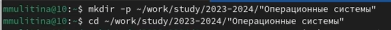{#fig:014 width=70%}

(рис. [-@fig:015]).

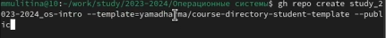{#fig:015 width=70%}

(рис. [-@fig:016]).

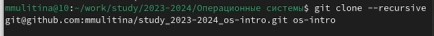{#fig:016 width=70%}

## Настройка каталога курса

Перейдем в каталог курса (рис. [-@fig:017]).

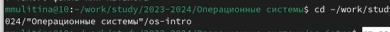{#fig:017 width=70%}

Удалим лишние файлы (рис. [-@fig:018]).

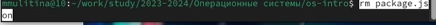{#fig:018 width=70%}

Создадим необходимые каталоги (рис. [-@fig:019]).

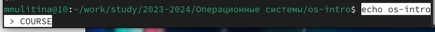{#fig:019 width=70%}

(рис. [-@fig:020]).

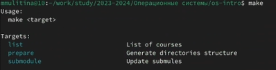{#fig:020 width=70%}

Отправим файлы на сервер (рис. [-@fig:021]).

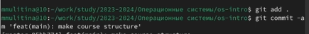{#fig:021 width=70%}

(рис. [-@fig:022]).

{#fig:022 width=70%}

# Контрольные вопросы

1. Системы контроля версий (Version Control System, VCS) применяются при работе нескольких человек над одним проектом. Обычно основное дерево проекта хранится в локальном или удалённом репозитории, к которому настроен доступ для участников проекта. При внесении изменений в содержание проекта система контроля версий позволяет их фиксировать, совмещать изменения, произведённые разными участниками проекта, производить откат к любой более ранней версии проекта, если это требуется.

2. Хранилище -  единый репозиторий для хранения файлов. Commit - сохранить все добавленные изменения и все изменённые файлы. История - история изменений репозитория. Рабочая копия - копия проекта, основанная на версии из хранилища.

3. В отличие от классических, в распределённых системах контроля версий центральный репозиторий не является обязательным. Классические - CVS, Subversion.
Распределенные - Git, Bazaar, Mercurial.

4. Создание и подключение удаленного репозитория, отправка изменений проекта на сервер.

5. Системы контроля версий могут обеспечивать дополнительные, более гибкие функциональные возможности. Например, они могут поддерживать работу с несколькими версиями одного файла, сохраняя общую историю изменений до точки ветвления версий и собственные истории изменений каждой ветви. Кроме того, обычно доступна информация о том, кто из участников, когда и какие изменения вносил. Обычно такого рода информация хранится в журнале изменений, доступ к которому можно ограничить.

6. Система контроля версий Git представляет собой набор программ командной строки. Доступ к ним можно получить из терминала посредством ввода команды git с различными опциями.

7. Создание основного дерева репозитория git init,  получение обновлений текущего дерева из центрального репозитория git pull, отправка всех произведённых изменений локального дерева в центральный репозиторий git push, просмотр списка измененных файлов в текущей директории git status, просмотр текущих изменений, сохранение текущих и добавленных изменений git diff.

8. git push - отправление из локального репозитория на удаленный.

9. Для разработки отдельных частей проекта.

10. Для игнорирования файлов, которые не стоит добавлять в репозиторий. С помощью конфигурационного файла gitignore.

# Выводы

В процессе выполнения работы я изучила применение средств контроля версий Git.

# Список литературы{.unnumbered}

1. Лабораторная работа №2.
