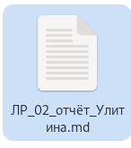
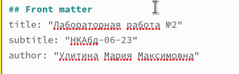
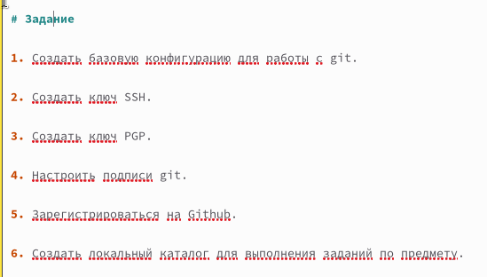
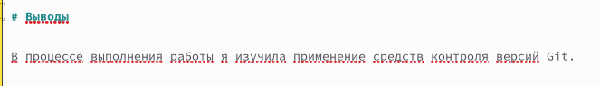
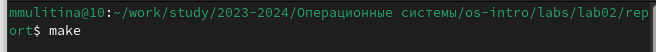
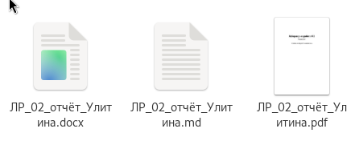

---
## Front matter
lang: ru-RU
title: Лабораторная работа №3
subtitle: НКАбд-06-23
author:
  - Улитина М.М.
institute:
  - Российский университет дружбы народов, Москва, Россия

date: 02 марта 2024

## i18n babel
babel-lang: russian
babel-otherlangs: english

## Fonts
mainfont: PT Serif
romanfont: PT Serif
sansfont: PT Sans
monofont: PT Mono
mainfontoptions: Ligatures=TeX
romanfontoptions: Ligatures=TeX
sansfontoptions: Ligatures=TeX,Scale=MatchLowercase
monofontoptions: Scale=MatchLowercase,Scale=0.9

## Formatting pdf
toc: false
toc-title: Содержание
slide_level: 2
aspectratio: 169
section-titles: true
theme: metropolis
header-includes:
 - \metroset{progressbar=frametitle,sectionpage=progressbar,numbering=fraction}
 - '\makeatletter'
 - '\beamer@ignorenonframefalse'
 - '\makeatother'
---

# Информация

## Докладчик

:::::::::::::: {.columns align=center}
::: {.column width="70%"}

  * Улитина Мария Максимовна
  * студентка группы НКАбд-06-23
  * Российский университет дружбы народов

:::
::: {.column width="30%"}

:::
::::::::::::::

# Вводная часть

## Цели и задачи

Научиться оформлять отчёты с помощью легковесного языка разметки Markdown.

# Выполнение лабораторной работы

## Создание файла для лабораторной работы №2

Создам файл, скопировав шаблон.

## Заполнение шаблона

Заполняю титульный лист 

## Заполнение шаблона

Опишу задание, необходимое выполнить

## Заполнение шаблона

Опишу процесс выполнение лабораторной работы, дополняя описание снимками экрана

## Заполнение шаблона

Напишу выводы, согласованные с целью выполнения лабораторной работы

## Ипользование make

Перейду в терминал, открою директорию, где находится файл с отчетом. Введу make

## Ипользование make

Получу необходимые мне файлы .docx и .pdf (рис. [-@fig:007]).

{#fig:007 width=70%}

# Выводы

## Выводы

В процессе выполнения лабораторной работы №3 я научилась оформлять отчёты с помощью легковесного языка разметки Markdown.

## Список литературы

1. Лабораторная работа №3.

