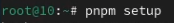
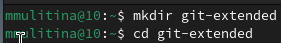
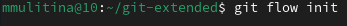
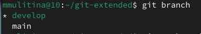
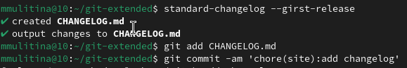
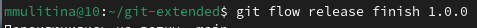
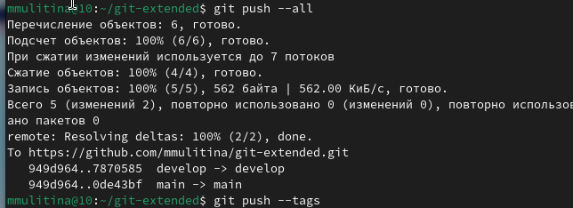
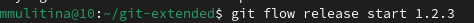
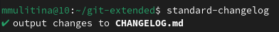
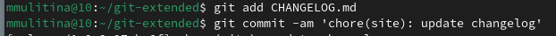

---
## Front matter
lang: ru-RU
title: Лабораторная работа №4
subtitle: НКАбд-06-23
author:
  - Улитина М.М.
institute:
  - Российский университет дружбы народов, Москва, Россия

date: 08 марта 2024

## i18n babel
babel-lang: russian
babel-otherlangs: english

## Fonts
mainfont: PT Serif
romanfont: PT Serif
sansfont: PT Sans
monofont: PT Mono
mainfontoptions: Ligatures=TeX
romanfontoptions: Ligatures=TeX
sansfontoptions: Ligatures=TeX,Scale=MatchLowercase
monofontoptions: Scale=MatchLowercase,Scale=0.9

## Formatting pdf
toc: false
toc-title: Содержание
slide_level: 2
aspectratio: 169
section-titles: true
theme: metropolis
header-includes:
 - \metroset{progressbar=frametitle,sectionpage=progressbar,numbering=fraction}
 - '\makeatletter'
 - '\beamer@ignorenonframefalse'
 - '\makeatother'
---

# Информация

## Докладчик

:::::::::::::: {.columns align=center}
::: {.column width="70%"}

  * Улитина Мария Максимовна
  * студентка группы НКАбд-06-23
  * Российский университет дружбы народов

:::
::: {.column width="30%"}

:::
::::::::::::::

# Вводная часть

## Цели и задачи

Получить навыки правильной работы с репозиториями git.

# Выполнение лабораторной работы

## Установка gitflow

Установим gitflow 

## Настроим node.js

## Установка программ

Установим программу, используемую для помощи в форматировании коммитов 

## Установка программ

Установим программу, используемую для помощи в создании логов

## Создание каталога

Создадим каталог для репозитория и перейдем в него 

{#fig:007 width=70%}

## Создание репозитория

Создадим репозиторий 

## Конфигурация для пакетов Node.js

Создадим конфигурацию для пакетов Node.js 

## Инициализируем git-flow

Инициализируем git-flow 

 
## Ветка develop

Проверим, что мы на ветке develop 

## Загрузка репозитория в хранилище 

Загрузим весь репозиторий в хранилище 

## Установим внешнюю ветку как вышестоящую для этой ветки 

## Создадим релиз с версией 1.0.0

## Создадим журнал изменений и добавим журнал изменений в индекс

## Зальём релизную ветку в основную ветку

## Отправим данные на github

## Создадим релиз на github

## Работа с репозиторием git

Создадим ветку для новой функциональности

## Работа с репозиторием git

По окончании разработки новой функциональности следующим шагом следует объединить ветку feature_branch c develop 

## Работа с репозиторием git

Создадим релиз с версией 1.2.3:

## Работа с репозиторием git

Создадим журнал изменений 

## Работа с репозиторием git

Добавим журнал изменений в индекс

## Работа с репозиторием git

Зальём релизную ветку в основную ветку 

## Работа с репозиторием git

Отправим данные на github 

## Работа с репозиторием git

[данные на github](image/29.PNG)

## Работа с репозиторием git

## Работа с репозиторием git

Создадим релиз на github с комментарием из журнала изменений 

# Выводы

## Выводы

В процессе выполнения лабораторной работы я получила навыки правильной работы с репозиториями git.

## Список литературы

1. Лабораторная работа №4.

