---
## Front matter
title: "Лабораторная работа №4"
subtitle: "НКАбд-06-23"
author: "Улитина Мария Максимовна"

## Generic otions
lang: ru-RU
toc-title: "Содержание"

## Bibliography
bibliography: bib/cite.bib
csl: pandoc/csl/gost-r-7-0-5-2008-numeric.csl

## Pdf output format
toc: true # Table of contents
toc-depth: 2
lof: true # List of figures
lot: true # List of tables
fontsize: 12pt
linestretch: 1.5
papersize: a4
documentclass: scrreprt
## I18n polyglossia
polyglossia-lang:
  name: russian
  options:
	- spelling=modern
	- babelshorthands=true
polyglossia-otherlangs:
  name: english
## I18n babel
babel-lang: russian
babel-otherlangs: english
## Fonts
mainfont: PT Serif
romanfont: PT Serif
sansfont: PT Sans
monofont: PT Mono
mainfontoptions: Ligatures=TeX
romanfontoptions: Ligatures=TeX
sansfontoptions: Ligatures=TeX,Scale=MatchLowercase
monofontoptions: Scale=MatchLowercase,Scale=0.9
## Biblatex
biblatex: true
biblio-style: "gost-numeric"
biblatexoptions:
  - parentracker=true
  - backend=biber
  - hyperref=auto
  - language=auto
  - autolang=other*
  - citestyle=gost-numeric
## Pandoc-crossref LaTeX customization
figureTitle: "Рис."
tableTitle: "Таблица"
listingTitle: "Листинг"
lofTitle: "Список иллюстраций"
lotTitle: "Список таблиц"
lolTitle: "Листинги"
## Misc options
indent: true
header-includes:
  - \usepackage{indentfirst}
  - \usepackage{float} # keep figures where there are in the text
  - \floatplacement{figure}{H} # keep figures where there are in the text
---

# Цель работы

Получение навыков правильной работы с репозиториями git.

# Задание

1. Выполнить работу для тестового репозитория.
2. Преобразовать рабочий репозиторий в репозиторий с git-flow и conventional commits.

# Теоретическое введение

Gitflow Workflow опубликована и популяризована Винсентом Дриссеном.
Gitflow Workflow предполагает выстраивание строгой модели ветвления с учётом выпуска проекта.
Данная модель отлично подходит для организации рабочего процесса на основе релизов.
Работа по модели Gitflow включает создание отдельной ветки для исправлений ошибок в рабочей среде.

# Выполнение лабораторной работы

Установим gitflow (рис. [-@fig:001]).

{#fig:001 width=70%}

(рис. [-@fig:002])

{#fig:002 width=70%}

Настроим node.js

(рис. [-@fig:003])

{#fig:003 width=70%}

(рис. [-@fig:004])

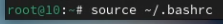{#fig:004 width=70%}

Установим программу, используемую для помощи в форматировании коммитов (рис. [-@fig:005])

{#fig:005 width=70%}

Установим программу, используемую для помощи в создании логов (рис. [-@fig:006])

{#fig:006 width=70%}

Создадим каталог для репозитория и перейдем в него (рис. [-@fig:007])

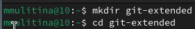{#fig:007 width=70%}

Создадим репозиторий (рис. [-@fig:008])

{#fig:008 width=70%}

Отправим файл в репозиторий (рис. [-@fig:009])

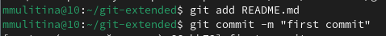{#fig:009 width=70%}

Отправим изменения на сервер (рис. [-@fig:010])

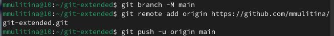{#fig:010 width=70%}

Создадим конфигурацию для пакетов Node.js (рис. [-@fig:011])

{#fig:011 width=70%}

Изменим конфигурацию и отправим файлы на сервер (рис. [-@fig:012])

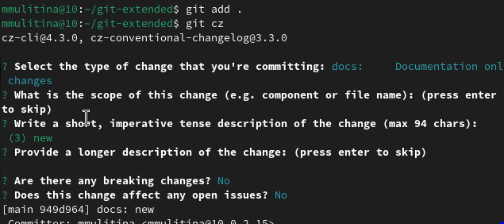{#fig:012 width=70%}

Инициализируем git-flow (рис. [-@fig:013])

{#fig:013 width=70%}

Проверим, что мы на ветке develop (рис. [-@fig:014])

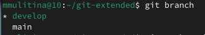{#fig:014 width=70%}

Загрузим весь репозиторий в хранилище (рис. [-@fig:015])

{#fig:015 width=70%}

Установим внешнюю ветку как вышестоящую для этой ветки (рис. [-@fig:016])

{#fig:016 width=70%}

Создадим релиз с версией 1.0.0 (рис. [-@fig:017])

{#fig:017 width=70%}

Создадим журнал изменений и добавим журнал изменений в индекс (рис. [-@fig:018])

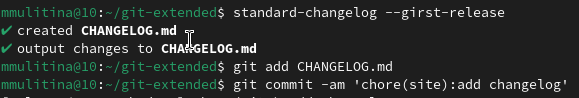{#fig:018 width=70%}

Зальём релизную ветку в основную ветку (рис. [-@fig:019])

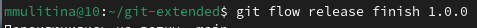{#fig:019 width=70%}

Отправим данные на github (рис. [-@fig:020])

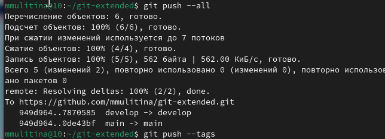{#fig:020 width=70%}

Создадим релиз на github. Для этого будем использовать утилиты работы с github (рис. [-@fig:021])

{#fig:021 width=70%}

## Работа с репозиторием git

Создадим ветку для новой функциональности (рис. [-@fig:022])

{#fig:022 width=70%}

По окончании разработки новой функциональности следующим шагом следует объединить ветку feature_branch c develop (рис. [-@fig:023])

{#fig:023 width=70%}

Создадим релиз с версией 1.2.3: (рис. [-@fig:024])

{#fig:024 width=70%} 

Создадим журнал изменений (рис. [-@fig:025])

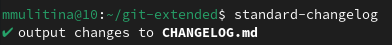{#fig:025 width=70%} 

Добавим журнал изменений в индекс (рис. [-@fig:026])

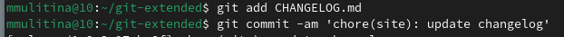{#fig:026 width=70%} 

Зальём релизную ветку в основную ветку (рис. [-@fig:027])

{#fig:027 width=70%} 

Отправим данные на github (рис. [-@fig:028])

{#fig:028 width=70%} 

(рис. [-@fig:029])

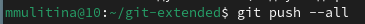{#fig:029 width=70%} 

(рис. [-@fig:030])

{#fig:030 width=70%} 

Создадим релиз на github с комментарием из журнала изменений (рис. [-@fig:031])

{#fig:031 width=70%}

# Выводы

В процессе выполнения лабораторной работы я получила навыки правильной работы с репозиториями git.

# Список литературы{.unnumbered}

1. Лабораторная работа №4.
