---
## Front matter
lang: ru-RU
title: Лабораторная работа №5
subtitle: НКАбд-06-23
author:
  - Улитина М.М.
institute:
  - Российский университет дружбы народов, Москва, Россия

date: 16 марта 2024

## i18n babel
babel-lang: russian
babel-otherlangs: english

## Fonts
mainfont: PT Serif
romanfont: PT Serif
sansfont: PT Sans
monofont: PT Mono
mainfontoptions: Ligatures=TeX
romanfontoptions: Ligatures=TeX
sansfontoptions: Ligatures=TeX,Scale=MatchLowercase
monofontoptions: Scale=MatchLowercase,Scale=0.9

## Formatting pdf
toc: false
toc-title: Содержание
slide_level: 2
aspectratio: 169
section-titles: true
theme: metropolis
header-includes:
 - \metroset{progressbar=frametitle,sectionpage=progressbar,numbering=fraction}
 - '\makeatletter'
 - '\beamer@ignorenonframefalse'
 - '\makeatother'
---

# Информация

## Докладчик

:::::::::::::: {.columns align=center}
::: {.column width="70%"}

  * Улитина Мария Максимовна
  * студентка группы НКАбд-06-23
  * Российский университет дружбы народов

:::
::: {.column width="30%"}

:::
::::::::::::::

# Вводная часть

## Цели и задачи

Освоить работу с менеджером паролей pass.

# Выполнение лабораторной работы

## Установим менеджер паролей pass

Установим gitflow 

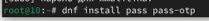

## gopass

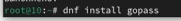

## Просмотрим списка ключей

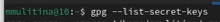

## Создадим новый ключ

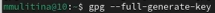

## Инициализируем хранилище 

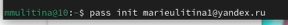

## Создадим структуру git

## Установим необходимые плагины

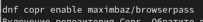

## Добавим новый пароль

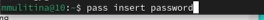
 
## Отобразим пароль для указанного файла 

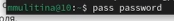

## Заменим существующий пароль

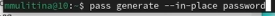

## Установим дополнительное программное обеспечение

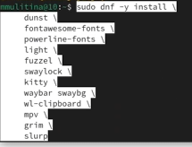

## Установим необходимые шрифты

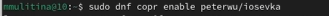

## Установим бинарный файл

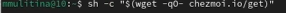

## Создадим репозиторий по шаблону

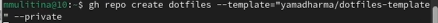

## Инициализируем chezmoi с репозиторием dotfiles 

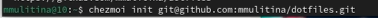

## Просмотрим изменения и примененим их

## Извлечем изменения и применим их одной командой 

## Извлечем последние изменения из своего репозитория

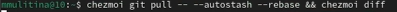

## Применим изменения

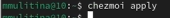

## Изменим неоходимые параметры файла конфигурации

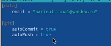

# Выводы

## Выводы

В процессе выполнения лабораторной работы я освоила работу с менеджером паролей pass.

## Список литературы

1. Лабораторная работа №5.

