---
## Front matter
title: Лабораторная работа №5
subtitle: НКАбд-06-23
author: Улитина Мария Максимовна

## Generic otions
lang: ru-RU
toc-title: "Содержание"

## Bibliography
bibliography: bib/cite.bib
csl: pandoc/csl/gost-r-7-0-5-2008-numeric.csl

## Pdf output format
toc: true # Table of contents
toc-depth: 2
lof: true # List of figures
lot: true # List of tables
fontsize: 12pt
linestretch: 1.5
papersize: a4
documentclass: scrreprt
## I18n polyglossia
polyglossia-lang:
  name: russian
  options:
	- spelling=modern
	- babelshorthands=true
polyglossia-otherlangs:
  name: english
## I18n babel
babel-lang: russian
babel-otherlangs: english
## Fonts
mainfont: PT Serif
romanfont: PT Serif
sansfont: PT Sans
monofont: PT Mono
mainfontoptions: Ligatures=TeX
romanfontoptions: Ligatures=TeX
sansfontoptions: Ligatures=TeX,Scale=MatchLowercase
monofontoptions: Scale=MatchLowercase,Scale=0.9
## Biblatex
biblatex: true
biblio-style: "gost-numeric"
biblatexoptions:
  - parentracker=true
  - backend=biber
  - hyperref=auto
  - language=auto
  - autolang=other*
  - citestyle=gost-numeric
## Pandoc-crossref LaTeX customization
figureTitle: "Рис."
tableTitle: "Таблица"
listingTitle: "Листинг"
lofTitle: "Список иллюстраций"
lotTitle: "Список таблиц"
lolTitle: "Листинги"
## Misc options
indent: true
header-includes:
  - \usepackage{indentfirst}
  - \usepackage{float} # keep figures where there are in the text
  - \floatplacement{figure}{H} # keep figures where there are in the text
---

# Цель работы

Освоить работу с менеджером паролей pass.

# Задание

1. Установка менеджера паролей pass.

2. Управление файлами конфигурации.

3. Установка дополнительного программного обеспечения.

# Теоретическое введение

Менеджер паролей pass — программа, сделанная в рамках идеологии Unix.
Также носит название стандартного менеджера паролей для Unix (The standard Unix password manager).
Данные хранятся в файловой системе в виде каталогов и файлов.
Файлы шифруются с помощью GPG-ключа.

# Выполнение лабораторной работы

Установим менеджер паролей pass (рис. [-@fig:001]).

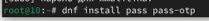{#fig:001 width=70%}

и gopass (рис. [-@fig:002]).

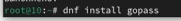{#fig:002 width=70%}

Просмотрим списка ключей (рис. [-@fig:003]).

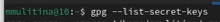{#fig:003 width=70%}

Создадим новый ключ (рис. [-@fig:004]).

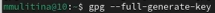{#fig:004 width=70%}

Инициализируем хранилище (рис. [-@fig:005]).

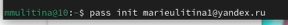{#fig:005 width=70%}

Создадим структуру git (рис. [-@fig:006]).

{#fig:006 width=70%}

Установим необходимые плагины (рис. [-@fig:007]).

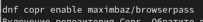{#fig:007 width=70%}

(рис. [-@fig:008]).

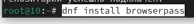{#fig:008 width=70%}

Добавим новый пароль (рис. [-@fig:009]).

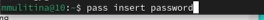{#fig:009 width=70%}

Отобразим пароль для указанного файла (рис. [-@fig:010]).

{#fig:010 width=70%}

Заменим существующий пароль (рис. [-@fig:011]).

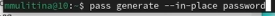{#fig:011 width=70%}

Установим дополнительное программное обеспечение (рис. [-@fig:012]).

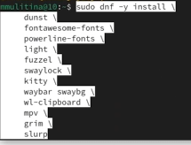{#fig:012 width=70%}

Установим необходимые шрифты (рис. [-@fig:013]).

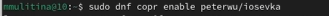{#fig:013 width=70%}

(рис. [-@fig:014]).

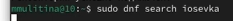{#fig:014 width=70%}

(рис. [-@fig:013]).

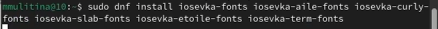{#fig:015 width=70%}

Установим бинарный файл (рис. [-@fig:016]).

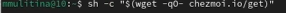{#fig:016 width=70%}

## Подключение репозитория

Создадим репозиторий по шаблону (рис. [-@fig:017]).

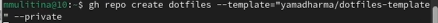{#fig:017 width=70%}

Инициализируем chezmoi с вашим репозиторием dotfiles (рис. [-@fig:018]).

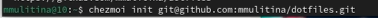{#fig:018 width=70%}

Просмотрим изменения и примененим их (рис. [-@fig:019]).

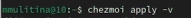{#fig:019 width=70%}

Извлечем изменения и применим их одной командой (рис. [-@fig:020]).

{#fig:020 width=70%}

Извлечем последние изменения из своего репозитория и посмотрим, что изменится, фактически не применяя изменения (рис. [-@fig:021]).

{#fig:021 width=70%}

Применим изменения (рис. [-@fig:022]).

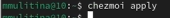{#fig:022 width=70%}

Изменим неоходимые параметры файла конфигурации (рис. [-@fig:023]).

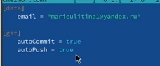{#fig:023 width=70%}

# Выводы

В процессе выполнения лабораторной работы я освоила работу с менеджером паролей pass.

# Список литературы{.unnumbered}

1. Лабораторная работа №5.
