---
## Front matter
lang: ru-RU
title: Лабораторная работа №6
subtitle: НКАбд-06-23
author:
  - Улитина М.М.
institute:
  - Российский университет дружбы народов, Москва, Россия

date: 16 марта 2024

## i18n babel
babel-lang: russian
babel-otherlangs: english

## Fonts
mainfont: PT Serif
romanfont: PT Serif
sansfont: PT Sans
monofont: PT Mono
mainfontoptions: Ligatures=TeX
romanfontoptions: Ligatures=TeX
sansfontoptions: Ligatures=TeX,Scale=MatchLowercase
monofontoptions: Scale=MatchLowercase,Scale=0.9

## Formatting pdf
toc: false
toc-title: Содержание
slide_level: 2
aspectratio: 169
section-titles: true
theme: metropolis
header-includes:
 - \metroset{progressbar=frametitle,sectionpage=progressbar,numbering=fraction}
 - '\makeatletter'
 - '\beamer@ignorenonframefalse'
 - '\makeatother'
---

# Информация

## Докладчик

:::::::::::::: {.columns align=center}
::: {.column width="70%"}

  * Улитина Мария Максимовна
  * студентка группы НКАбд-06-23
  * Российский университет дружбы народов

:::
::: {.column width="30%"}

:::
::::::::::::::

# Вводная часть

## Цели и задачи

Приобретение практических навыков взаимодействия пользователя с системой по-
средством командной строки.

# Выполнение лабораторной работы

## Определим полное имя домашнего каталога

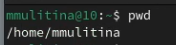

## Перейдем в каталог /tmp 

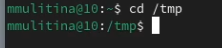

## Выведем на экран содержимое каталога с помощью ls с разными опциями

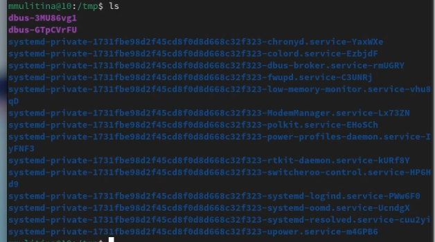

## Определим, есть ли в необходимом каталоге подкаталог cron

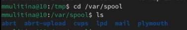

## В домашнем каталоге создадим новый каталог с именем newdir  

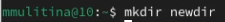

## В этом каталоге создадим подкаталог morefun 

## Одной командой создадим три каталога

## Удалим эти каталоги одной командой

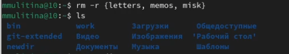
 
## Попробуем удалить каталог newdir

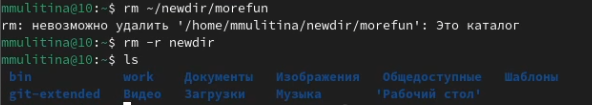

## C помощью команды man определим необходимую опцию команды ls

## Используем man для определения основных опций команды cd 

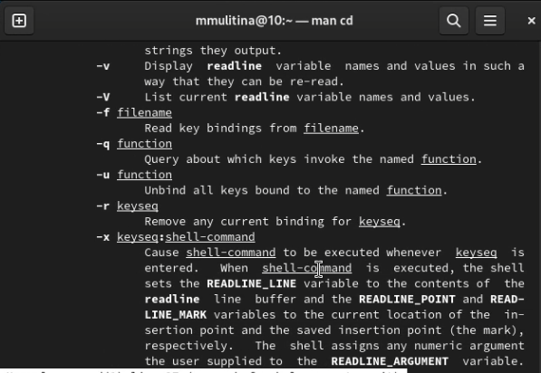

## Используем man для определения основных опций команды pwd

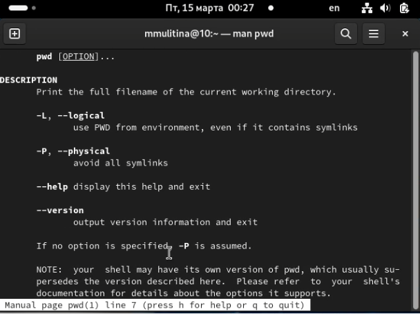

## Используем man для определения основных опций команды mkdir 

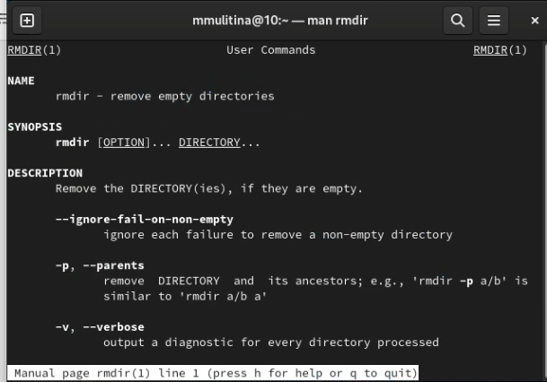

## Используем man для определения основных опций команды rmdir

## Используем man для определения основных опций команды rm

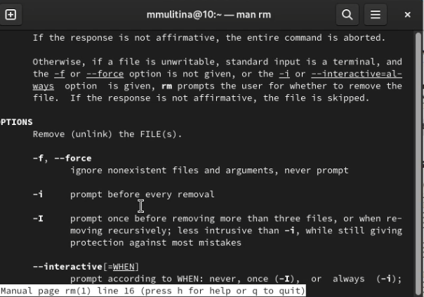

## Воспользуемся командой history

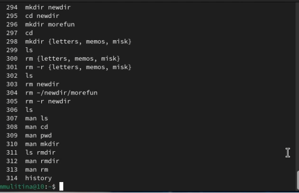

## Обратимся к прежде используемой команде 

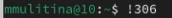

# Выводы

## Выводы

В процессе выполнения лабораторной работы я приобрела практические навыки взаимодействия пользователя с системой посредством командной строки.

## Список литературы

1. Лабораторная работа №6.

