---
## Front matter
title: Лабораторная работа №6
subtitle: НКАбд-06-23
author: Улитина Мария Максимовна

## Generic otions
lang: ru-RU
toc-title: "Содержание"

## Bibliography
bibliography: bib/cite.bib
csl: pandoc/csl/gost-r-7-0-5-2008-numeric.csl

## Pdf output format
toc: true # Table of contents
toc-depth: 2
lof: true # List of figures
lot: true # List of tables
fontsize: 12pt
linestretch: 1.5
papersize: a4
documentclass: scrreprt
## I18n polyglossia
polyglossia-lang:
  name: russian
  options:
	- spelling=modern
	- babelshorthands=true
polyglossia-otherlangs:
  name: english
## I18n babel
babel-lang: russian
babel-otherlangs: english
## Fonts
mainfont: PT Serif
romanfont: PT Serif
sansfont: PT Sans
monofont: PT Mono
mainfontoptions: Ligatures=TeX
romanfontoptions: Ligatures=TeX
sansfontoptions: Ligatures=TeX,Scale=MatchLowercase
monofontoptions: Scale=MatchLowercase,Scale=0.9
## Biblatex
biblatex: true
biblio-style: "gost-numeric"
biblatexoptions:
  - parentracker=true
  - backend=biber
  - hyperref=auto
  - language=auto
  - autolang=other*
  - citestyle=gost-numeric
## Pandoc-crossref LaTeX customization
figureTitle: "Рис."
tableTitle: "Таблица"
listingTitle: "Листинг"
lofTitle: "Список иллюстраций"
lotTitle: "Список таблиц"
lolTitle: "Листинги"
## Misc options
indent: true
header-includes:
  - \usepackage{indentfirst}
  - \usepackage{float} # keep figures where there are in the text
  - \floatplacement{figure}{H} # keep figures where there are in the text
---

# Цель работы

Приобретение практических навыков взаимодействия пользователя с системой по-
средством командной строки.

# Задание

1. Определить полное имя домашнего каталога.

2. Перейти в необходимые каталоги.

3. Создать и удалить необходимые каталоги.

4. Применить команду man.

5. Применить команду history.

# Теоретическое введение

В операционной системе типа Linux взаимодействие пользователя с системой обычно
осуществляется с помощью командной строки посредством построчного ввода ко-
манд. При этом обычно используется командные интерпретаторы языка shell: /bin/sh;
/bin/csh; /bin/ksh.

## Формат команды

Командой в операционной системе называется записанный по
специальным правилам текст (возможно с аргументами), представляющий собой ука-
зание на выполнение какой-либо функций (или действий) в операционной системе.
Обычно первым словом идёт имя команды, остальной текст — аргументы или опции,
конкретизирующие действие.
Общий формат команд можно представить следующим образом:
<имя_команды><разделитель><аргументы>

# Выполнение лабораторной работы

Определим полное имя домашнего каталога (рис. [-@fig:001]).

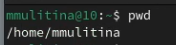{#fig:001 width=70%}

Перейдем в каталог /tmp (рис. [-@fig:002]).

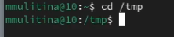{#fig:002 width=70%}

Выведем на экран содержимое каталога с помощью ls с разными опциями (рис. [-@fig:003]).

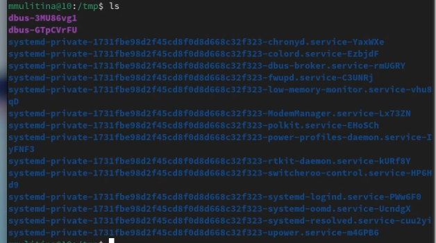{#fig:003 width=70%}

(рис. [-@fig:004]).

{#fig:004 width=70%}

(рис. [-@fig:005]).

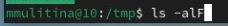{#fig:005 width=70%}

Определим, есть ли в необходимом каталоге подкаталог cron (рис. [-@fig:006]).

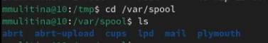{#fig:006 width=70%}

В домашнем каталоге создадим новый каталог с именем newdir (рис. [-@fig:007]).

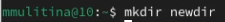{#fig:007 width=70%}

В этом каталоге создадим подкаталог morefun (рис. [-@fig:008]).

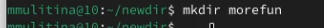{#fig:008 width=70%}

Одной командой создадим три каталога (рис. [-@fig:009]).

{#fig:009 width=70%}

Удалим эти каталоги одной командой (рис. [-@fig:010]).

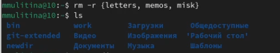{#fig:010 width=70%}

Попробуем удалить каталог newdir (рис. [-@fig:011]).

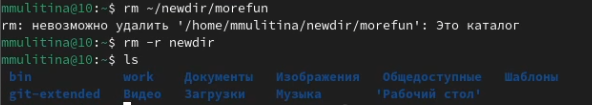{#fig:011 width=70%} 

C помощью команды man определим необходимую опцию команды ls  (рис. [-@fig:012]).

{#fig:012 width=70%}

C помощью команды man определим необходимую опцию команды ls  (рис. [-@fig:013]).

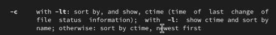{#fig:013 width=70%}

Используем man для определения основных опций команды cd (рис. [-@fig:014]).

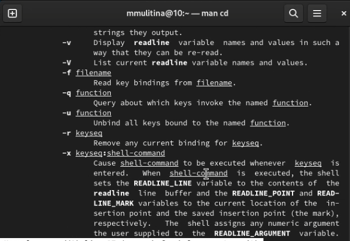{#fig:014 width=70%}

Используем man для определения основных опций команды pwd (рис. [-@fig:015]).

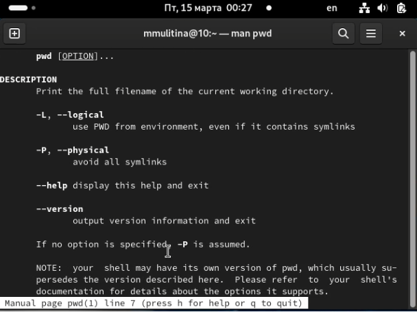{#fig:015 width=70%}

Используем man для определения основных опций команды mkdir (рис. [-@fig:016]).

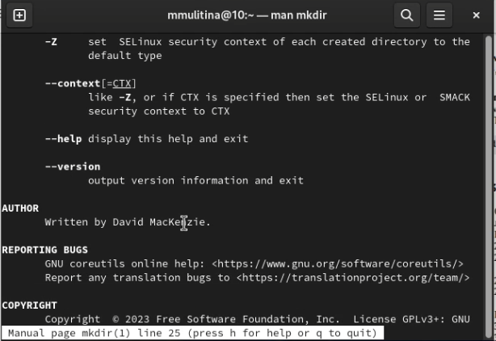{#fig:016 width=70%}

Используем man для определения основных опций команды rmdir (рис. [-@fig:017]).

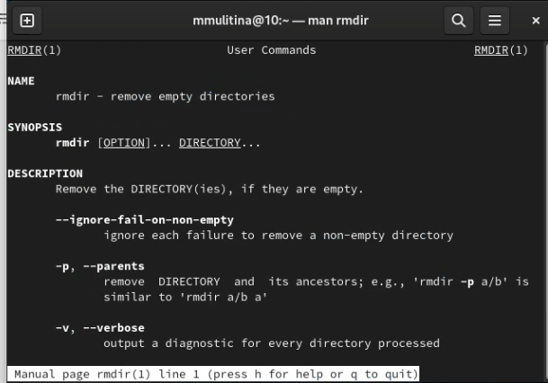{#fig:017 width=70%}

Используем man для определения основных опций команды rm (рис. [-@fig:018]).

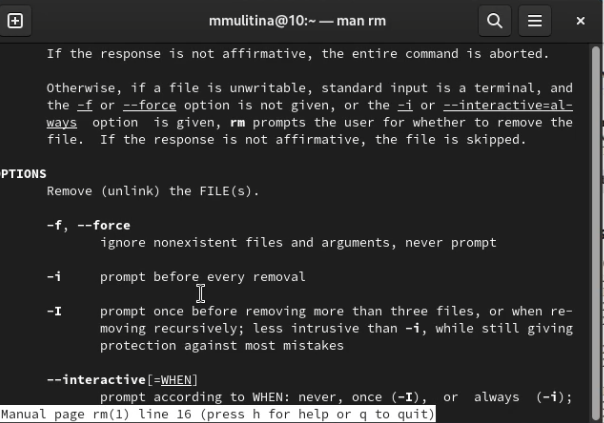{#fig:018 width=70%}

Воспользуемся командой history (рис. [-@fig:019]).

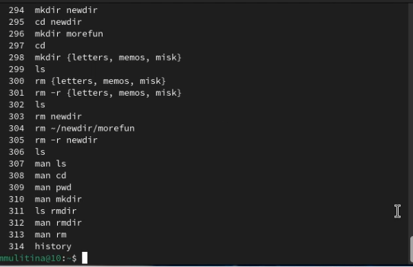{#fig:019 width=70%}

Обратимся к прежде используемой команде (рис. [-@fig:020]).

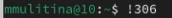{#fig:020 width=70%}

Обратимся к прежде используемой команде (рис. [-@fig:021]).

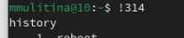{#fig:021 width=70%}

# Контрольные вопросы

1. Командная строка - интерфейс для взаимодействия пользователя с операционной системой при помощи команд.
2. pwd Пример: /home/mmulitina
3. ls. Можно применить опции -a, -alF.
4. При помощи ls -a.
5. rm и rmdir. Каталог, содержащий подкаталоги можно удалить с помощью  rm -r.
6. History.
7. Написать номер команды с !.
8. cd; ls.
9. Экранирование осуществляется с помощью \ 
10. О каждом файле будет выведена информация о типе файла, правах доступа, числе ссылок, владельце, размере, дате последней ревизии, имени файла или каталога.
11. Относительный путь файла - путь к файлу из текущей директории.
12. С помощью man.
13. Клавиша tab.

# Выводы

В процессе выполнения лабораторной работы я приобрела практические навыки взаимодействия пользователя с системой посредством командной строки.

# Список литературы{.unnumbered}

1. Лабораторная работа №6.
