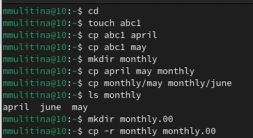
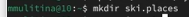
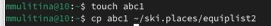
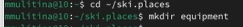
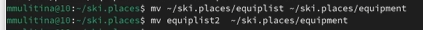
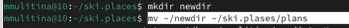
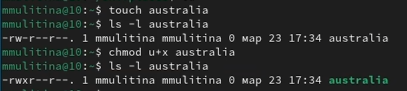
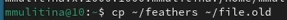
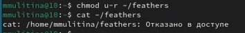

---
## Front matter
lang: ru-RU
title: Лабораторная работа №7
subtitle: НКАбд-06-23
author:
  - Улитина М.М.
institute:
  - Российский университет дружбы народов, Москва, Россия

date: 23 марта 2024

## i18n babel
babel-lang: russian
babel-otherlangs: english

## Fonts
mainfont: PT Serif
romanfont: PT Serif
sansfont: PT Sans
monofont: PT Mono
mainfontoptions: Ligatures=TeX
romanfontoptions: Ligatures=TeX
sansfontoptions: Ligatures=TeX,Scale=MatchLowercase
monofontoptions: Scale=MatchLowercase,Scale=0.9

## Formatting pdf
toc: false
toc-title: Содержание
slide_level: 2
aspectratio: 169
section-titles: true
theme: metropolis
header-includes:
 - \metroset{progressbar=frametitle,sectionpage=progressbar,numbering=fraction}
 - '\makeatletter'
 - '\beamer@ignorenonframefalse'
 - '\makeatother'
---

# Информация

## Докладчик

:::::::::::::: {.columns align=center}
::: {.column width="70%"}

  * Улитина Мария Максимовна
  * студентка группы НКАбд-06-23
  * Российский университет дружбы народов

:::
::: {.column width="30%"}

:::
::::::::::::::

# Вводная часть

## Цели и задачи

Ознакомление с файловой системой Linux, её структурой, именами и содержанием каталогов. Приобретение практических навыков по применению команд для работы с файлами и каталогами, по управлению процессами (и работами), по проверке использования диска и обслуживанию файловой системы.

# Выполнение лабораторной работы

## Выполню все примеры из лабораторной работы

## Скопирую необходимый файл и назову equipment

## В домашнем каталоге создам необходимую директорию

## Переместим туда файл

## Создадим файл abc1 и скопируем его в каталог

## Создадим каталог equipment 

## Переместим файлы

## Создадим каталог newdir и переместим файлы

 
## Определим опции команды chmod и изменим права доступа к необходимым файлам

## Посмотрим содержание необходимого файла

## Скопируем файл

## Переместим файлы

## Лишим владельца файла feathers права на чтение

## С помощью man посмотрим mount

# Выводы

## Выводы

В процессе выполнения лабораторной работы с ознакомилась с файловой системой Linux и ее структурой.

## Список литературы

1. Лабораторная работа №7.

