---
## Front matter
title: Лабораторная работа №7.
subtitle: НКАбд-06-23
author: Улитина Мария Максимовна

## Generic otions
lang: ru-RU
toc-title: "Содержание"

## Bibliography
bibliography: bib/cite.bib
csl: pandoc/csl/gost-r-7-0-5-2008-numeric.csl

## Pdf output format
toc: true # Table of contents
toc-depth: 2
lof: true # List of figures
lot: true # List of tables
fontsize: 12pt
linestretch: 1.5
papersize: a4
documentclass: scrreprt
## I18n polyglossia
polyglossia-lang:
  name: russian
  options:
	- spelling=modern
	- babelshorthands=true
polyglossia-otherlangs:
  name: english
## I18n babel
babel-lang: russian
babel-otherlangs: english
## Fonts
mainfont: PT Serif
romanfont: PT Serif
sansfont: PT Sans
monofont: PT Mono
mainfontoptions: Ligatures=TeX
romanfontoptions: Ligatures=TeX
sansfontoptions: Ligatures=TeX,Scale=MatchLowercase
monofontoptions: Scale=MatchLowercase,Scale=0.9
## Biblatex
biblatex: true
biblio-style: "gost-numeric"
biblatexoptions:
  - parentracker=true
  - backend=biber
  - hyperref=auto
  - language=auto
  - autolang=other*
  - citestyle=gost-numeric
## Pandoc-crossref LaTeX customization
figureTitle: "Рис."
tableTitle: "Таблица"
listingTitle: "Листинг"
lofTitle: "Список иллюстраций"
lotTitle: "Список таблиц"
lolTitle: "Листинги"
## Misc options
indent: true
header-includes:
  - \usepackage{indentfirst}
  - \usepackage{float} # keep figures where there are in the text
  - \floatplacement{figure}{H} # keep figures where there are in the text
---

# Цель работы

Ознакомление с файловой системой Linux, её структурой, именами и содержанием каталогов. Приобретение практических навыков по применению команд для работы с файлами и каталогами, по управлению процессами (и работами), по проверке использования диска и обслуживанию файловой системы.

# Задание

1. Выполнить все примеры из лабораторной работы.

2. Выполнить необходимые действия с файлами и каталогами.

# Выполнение лабораторной работы

Выполню все примеры из лабораторной работы (рис. [-@fig:001]).

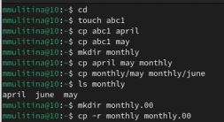{#fig:001 width=70%}

Скопирую необходимый файл и назову equipment (рис. [-@fig:002]).

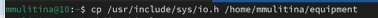{#fig:002 width=70%}

В домашнем каталоге создам необходимую директорию (рис. [-@fig:003]).

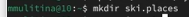{#fig:003 width=70%}

Переместим туда файл (рис. [-@fig:004]).

{#fig:004 width=70%}

Создадим файл abc1 и скопируем его в каталог (рис. [-@fig:005]).

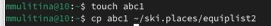{#fig:005 width=70%}

Создадим каталог equipment (рис. [-@fig:006]).

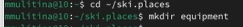{#fig:006 width=70%}

Переместим файлы (рис. [-@fig:007]).

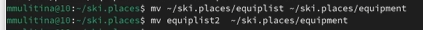{#fig:007 width=70%}

Создадим каталог newdir и переместим файлы (рис. [-@fig:008]).

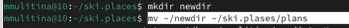{#fig:008 width=70%}

Определим опции команды chmod и изменим права доступа к необходимым файлам 

(рис. [-@fig:009]).

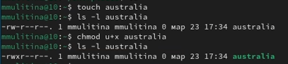{#fig:009 width=70%}

(рис. [-@fig:010]).

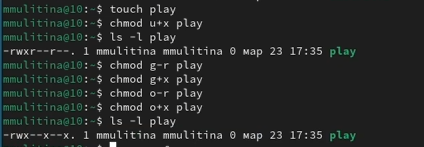{#fig:010 width=70%}

(рис. [-@fig:011]).

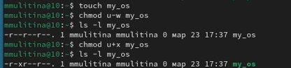{#fig:011 width=70%}

(рис. [-@fig:012]).

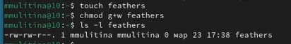{#fig:012 width=70%}

Посмотрим содержание необходимого файла (рис. [-@fig:013]).

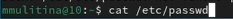{#fig:013 width=70%}

Скопируем файл (рис. [-@fig:014]).

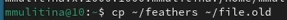{#fig:014 width=70%}

Переместим файлы (рис. [-@fig:015]).

{#fig:015 width=70%}

Скопируем (рис. [-@fig:016]).

{#fig:016 width=70%}

Лищим владельца файла feathers права на чтение (рис. [-@fig:017]).

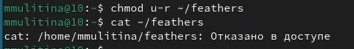{#fig:017 width=70%}

Вернем права (рис. [-@fig:018]).

{#fig:018 width=70%}

Лишим владельца play права на выполнение (рис. [-@fig:019]).

{#fig:019 width=70%} 

Вернем владельцу play право на выполнение (рис. [-@fig:020]).

{#fig:020 width=70%} 

С помощью man посмотрим mount (рис. [-@fig:021]).

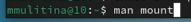{#fig:021 width=70%} 

С помощью man посмотрим fsck (рис. [-@fig:022]).

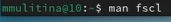{#fig:022 width=70%} 

С помощью man посмотрим mkfs (рис. [-@fig:023]).

{#fig:023 width=70%} 

С помощью man посмотрим kill (рис. [-@fig:024]).

{#fig:024 width=70%} 

# Выводы

В процессе выполнения лабораторной работы с ознакомилась с файловой системой Linux и ее структурой.

# Список литературы{.unnumbered}

1. Лабораторная работа №7.
