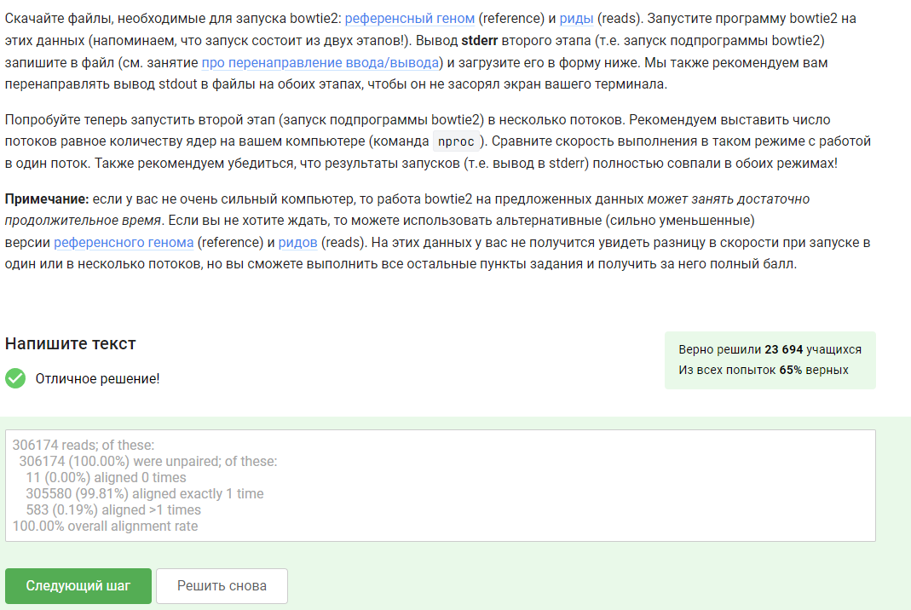

---
## Front matter
title: Отчёт по прохождению внешнего курса "Введение в Linux". Этап 2.
subtitle: НКАбд-06-23
author: Улитина Мария Максимовна

## Generic otions
lang: ru-RU
toc-title: "Содержание"

## Bibliography
bibliography: bib/cite.bib
csl: pandoc/csl/gost-r-7-0-5-2008-numeric.csl

## Pdf output format
toc: true # Table of contents
toc-depth: 2
lof: true # List of figures
lot: true # List of tables
fontsize: 12pt
linestretch: 1.5
papersize: a4
documentclass: scrreprt
## I18n polyglossia
polyglossia-lang:
  name: russian
  options:
	- spelling=modern
	- babelshorthands=true
polyglossia-otherlangs:
  name: english
## I18n babel
babel-lang: russian
babel-otherlangs: english
## Fonts
mainfont: PT Serif
romanfont: PT Serif
sansfont: PT Sans
monofont: PT Mono
mainfontoptions: Ligatures=TeX
romanfontoptions: Ligatures=TeX
sansfontoptions: Ligatures=TeX,Scale=MatchLowercase
monofontoptions: Scale=MatchLowercase,Scale=0.9
## Biblatex
biblatex: true
biblio-style: "gost-numeric"
biblatexoptions:
  - parentracker=true
  - backend=biber
  - hyperref=auto
  - language=auto
  - autolang=other*
  - citestyle=gost-numeric
## Pandoc-crossref LaTeX customization
figureTitle: "Рис."
tableTitle: "Таблица"
listingTitle: "Листинг"
lofTitle: "Список иллюстраций"
lotTitle: "Список таблиц"
lolTitle: "Листинги"
## Misc options
indent: true
header-includes:
  - \usepackage{indentfirst}
  - \usepackage{float} # keep figures where there are in the text
  - \floatplacement{figure}{H} # keep figures where there are in the text
---

# Цель работы

Изучить основы Linux.

# Выполнение лабораторной работы

##Задание 1

Пояснение: сервер может использоваться для ряда задач (рис. [-@fig:001]).

{#fig:001 width=70%}

##Задание 2

Пояснение: это публичная часть ключа (рис. [-@fig:002]).

{#fig:002 width=70%}

##Задание 3

Пояснение: -r используется для копирования директорий(рис. [-@fig:003]).

{#fig:003 width=70%}

##Задание 4

Пояснение: нужно применить команду или проверить интернет-соединение (рис. [-@fig:004]).

{#fig:004 width=70%}

##Задание 5

Пояснение: Filezilla - бесплатный FTP-менеджер, который поможет скачать и загрузить файлы с FTP-серверов. (рис. [-@fig:005]).

{#fig:005 width=70%}

##Задание 6

Пояснение: необходима настройка или обращение к подходящей версии программы (рис. [-@fig:006]).

{#fig:006 width=70%}

##Задание 7

Пояснение: надо воспользоваться help или man (рис. [-@fig:007]).

{#fig:007 width=70%}

##Задание 8

Пояснение: для ответа на вопрос мне было необходимо обратиться в документации программы (рис. [-@fig:008]).

{#fig:008 width=70%}

##Задание 9

Пояснение: для ответа на вопрос мне было необходимо обратиться в документации программы  (рис. [-@fig:009]).

{#fig:009 width=70%}

##Задание 10

Пояснение: ctrl+c прервет выполнение программы(рис. [-@fig:010]).

{#fig:010 width=70%}

##Задание 11

Пояснение: jobs просто выводит порядковые номера (рис. [-@fig:011]).

{#fig:011 width=70%}

##Задание 12

Пояснение:  kill -9 (рис. [-@fig:012]).

{#fig:012 width=70%}

##Задание 13

Пояснение: процесс приступит к завершению, как только будет продолжен (рис. [-@fig:013]).

{#fig:013 width=70%}

##Задание 14

Пояснение:  0% CPU (рис. [-@fig:014]).

{#fig:014 width=70%}

##Задание 15

Пояснение:  столько, сколько оно потребляет в момент остановки (рис. [-@fig:015]).

{#fig:015 width=70%}

##Задание 16

Пояснение:  никак (рис. [-@fig:016]).

{#fig:016 width=70%}

##Задание 17

Пояснение:  это можно узнать из документации программы (рис. [-@fig:017]).

{#fig:017 width=70%}

##Задание 18

Пояснение:   (рис. [-@fig:018]).

{#fig:018 width=70%}\

##Задание 19

Пояснение: терминал сообщит, что нет процесса для заупска в fg (рис. [-@fig:019]).

{#fig:019 width=70%}

##Задание 20

Пояснение: tmux завершит работу (рис. [-@fig:020]).

{#fig:020 width=70%}

##Задание 21

Пояснение:  соединение прервется, но работа tmux продолжится (рис. [-@fig:021]).

{#fig:021 width=70%}

##Задание 22

Пояснение:  вкладка закроется, а вместе с ней пропадает и запущенный в ней процесс (рис. [-@fig:022]).

{#fig:022 width=70%}

##Задание 23

Пояснение: для этого необходимо обратиться к справке tmux (рис. [-@fig:023]).

{#fig:023 width=70%}

##Задание 24

Пояснение: (рис. [-@fig:024]).

{#fig:024 width=70%}

# Выводы

Я выполнила второй этап внешнего курса по Linux.

