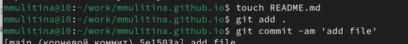

---
## Front matter
lang: ru-RU
title: Индивидуальный проект. Этап 1.
subtitle: НКАбд-06-23
author:
  - Улитина М.М.
institute:
  - Российский университет дружбы народов, Москва, Россия

date: 02 марта 2024

## i18n babel
babel-lang: russian
babel-otherlangs: english

## Fonts
mainfont: PT Serif
romanfont: PT Serif
sansfont: PT Sans
monofont: PT Mono
mainfontoptions: Ligatures=TeX
romanfontoptions: Ligatures=TeX
sansfontoptions: Ligatures=TeX,Scale=MatchLowercase
monofontoptions: Scale=MatchLowercase,Scale=0.9

## Formatting pdf
toc: false
toc-title: Содержание
slide_level: 2
aspectratio: 169
section-titles: true
theme: metropolis
header-includes:
 - \metroset{progressbar=frametitle,sectionpage=progressbar,numbering=fraction}
 - '\makeatletter'
 - '\beamer@ignorenonframefalse'
 - '\makeatother'
---

# Информация

## Докладчик

:::::::::::::: {.columns align=center}
::: {.column width="70%"}

  * Улитина Мария Максимовна
  * студентка группы НКАбд-06-23
  * Российский университет дружбы народов

:::
::: {.column width="30%"}

:::
::::::::::::::

# Вводная часть

## Цели и задачи

Размещение на Github pages заготовки для персонального сайта.

# Выполнение индивидуального проекта

## Установка необходимого ПО

Скачиваем hugo extended

## Установка шаблона темы сайта

Клонирую репозиторий github с шаблоном темы сайта

## Установка шаблона темы сайта

Клонирую созданный репозиторий в локальный репозиторий

## Размещение на хостинге git

Запускаю исполняемый файл

## Размещение на хостинге git

Запускаю hugo с параметром server 

##  Установка параметра для URLs сайта

Создаю новый пустой репозиторий - его имя будет адресом сайта

##  Установка параметра для URLs сайта

Клонирую репозиторий себе на компьютер

##  Установка параметра для URLs сайта

Создаю ветку с именем main

##  Установка параметра для URLs сайта

Создаю пустой файл README.md и отпраляю его в глобальный репозиторий

##  Установка параметра для URLs сайта

Отключаю в файле gitignore public, чтобы каталоги с таким именем не игнорировались

##  Установка параметра для URLs сайта

Подключаю репозиторий к каталогу public 

##  Установка параметра для URLs сайта

Снова запускаю hugo, тем самым заполняя public 

## Размещение заготовки сайта на GitHub pages

Отправляю изменения в глобальный репозиторий 

# Выводы

## Выводы

Я установила все необходимое программное обеспечение, разместила сайт на GitHub pages и выполнила первый этап индивидуального проекта.

