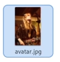
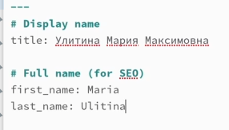
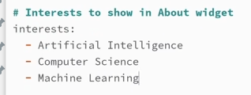
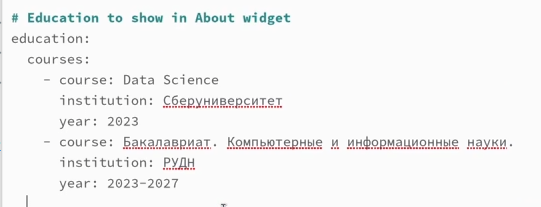
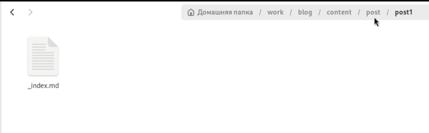
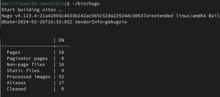
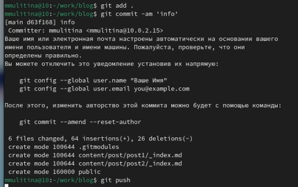

---
## Front matter
lang: ru-RU
title: Индивидуальный проект. Этап 2.
subtitle: НКАбд-06-23
author:
  - Улитина М.М.
institute:
  - Российский университет дружбы народов, Москва, Россия

date: 16 марта 2024

## i18n babel
babel-lang: russian
babel-otherlangs: english

## Fonts
mainfont: PT Serif
romanfont: PT Serif
sansfont: PT Sans
monofont: PT Mono
mainfontoptions: Ligatures=TeX
romanfontoptions: Ligatures=TeX
sansfontoptions: Ligatures=TeX,Scale=MatchLowercase
monofontoptions: Scale=MatchLowercase,Scale=0.9

## Formatting pdf
toc: false
toc-title: Содержание
slide_level: 2
aspectratio: 169
section-titles: true
theme: metropolis
header-includes:
 - \metroset{progressbar=frametitle,sectionpage=progressbar,numbering=fraction}
 - '\makeatletter'
 - '\beamer@ignorenonframefalse'
 - '\makeatother'
---

# Информация

## Докладчик

:::::::::::::: {.columns align=center}
::: {.column width="70%"}

  * Улитина Мария Максимовна
  * студентка группы НКАбд-06-23
  * Российский университет дружбы народов

:::
::: {.column width="30%"}

:::
::::::::::::::

# Вводная часть

## Цели и задачи

Заполнить основную информацию на персональном сайте.

# Выполнение индивидуального проекта

## Добавлю свое фото

{#fig:001 width=70%}

## Заполню информацию о себе и биографию

## Заполню информацию о своих интересах

## Заполню информацию о своем образовании

## Загружу тексты постов в необходимую папку 

##  Сгенерирую сайт

##  Отправлю изменения в репозиторий

# Выводы

## Выводы

Я заполнила необходимую информацию о себе и загрузила фото, а следовательно выполнила второй этап индивидуального проекта.

